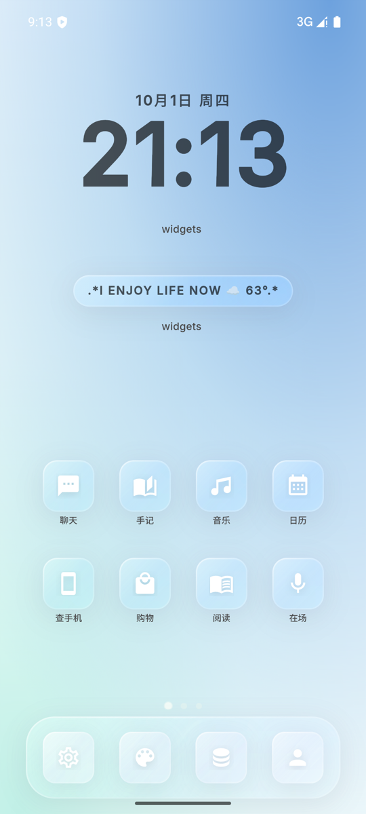
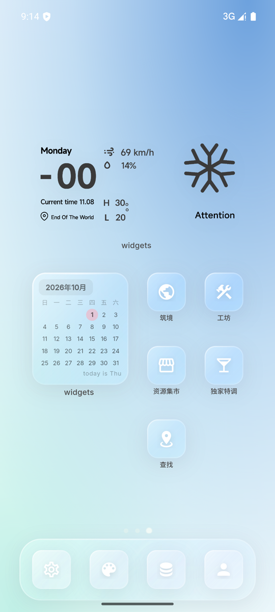
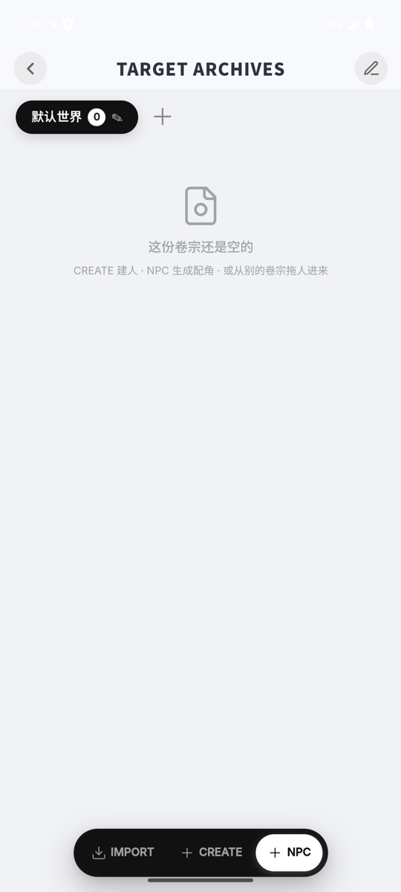
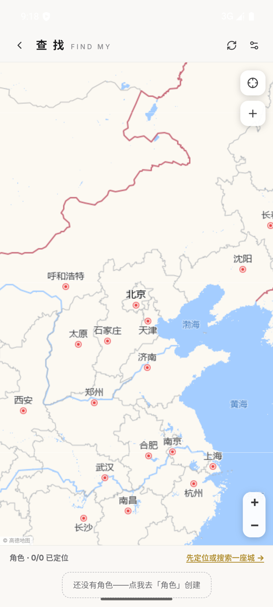
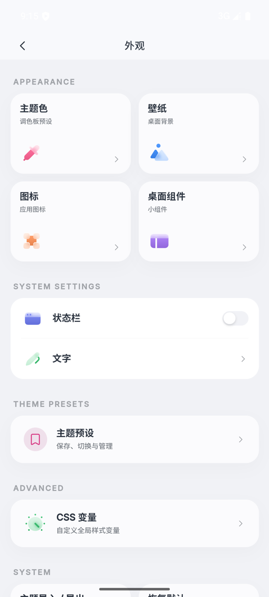
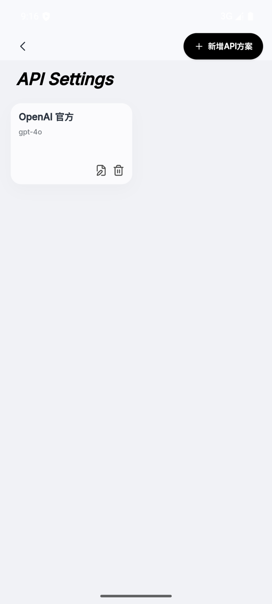

# Float · AI 虚拟手机（Web）

[](./LICENSE)

一部跑在浏览器里的 AI 虚拟手机：在屏幕上模拟一台完整的手机——桌面、图标、Dock、小组件、一堆可以点开的 App——里面住着你创造的 AI 角色。他们有作息、有日程、有位置、有记忆，会主动给你发消息、发朋友圈、写日记，也可以接你的语音和视频电话。

所有数据都存在本机浏览器里（IndexedDB）。联网只调你自己配置的 API——LLM、生图、语音、音乐，浏览器直连。这个仓库是网页版，用 Vite 在本地端口打开，不再打包 Android。安卓安装包仍在 [shiaho777/float-android](https://github.com/shiaho777/float-android)。

## 截图

| 桌面 | 小组件 | 会话列表 | 聊天 |
|---|---|---|---|
|  |  |  |  |

| 角色卷宗 | 查找·地图 | 外观自定义 | API 设置 |
|---|---|---|---|
|  |  |  |  |

## 为什么好用

- **装完就能玩**。装 APK → 填一个 LLM Key → 建角色 → 开聊，从装包到第一句话两分钟。
- **东西都在自己手里**。聊天、角色、图片、记忆存在本机，备份导出就是本地文件。
- **沉浸感是设计出来的**。角色不是一问一答的聊天框：他们按自己的时区作息和日程生活，会在地图上显示当前位置，知道当地货币的物价尺度，聊过的事会沉淀成长期记忆，性格还会随记忆反思慢慢演变——还会在你不说话的时候主动来消息、发朋友圈、写日记。
- **本地打开就能玩**。`npm run dev` 之后浏览器打开 `http://localhost:3001`。标签页开着，生成就继续；关掉页面，生成就停。
- **细节有手感**。桌面和 Dock 常驻挂载，返回桌面不闪烁；通话可以缩成悬浮小窗挂着聊；转账红包、双语对照、消息翻译、拍立得卡片……都是按真手机的习惯做的。
- **刷新不丢数据**。页面隐藏前会把在途的 IndexedDB 写入排空。导出备份走浏览器下载。

## 都有什么功能

**聊天（核心）**

- 私聊 / 群聊 / 语音消息 / 1v1 语音、视频通话（可缩小成悬浮小窗）
- 转账、红包、扫码付款卡片；角色有当地货币的金额感知
- 消息翻译、双语对照、屏幕特效（烟花等）、自定义聊天气泡和音效
- 群管理（禁言/踢人）、群通话、角色主动消息、安静时段免打扰、长期关系与记忆沉淀

**角色的生活**

- 今日世界：每天自动生成天气和各角色日程，角色间的互动会撮合对齐；主角逐个精写，NPC 批量简版省 token
- 查找：真实地图上钉角色的当前位置（高德路网 / 腾讯卫星），地点可标注、可绑定为家
- 栖所、日历、日记、经期记录：角色自己过日子
- 查手机：翻 TA 的 22 个 App——电话、信息、浏览器、相册、购物、资产、外卖、微博、抖音、B站、小红书、豆瓣、Steam 游戏库、邮箱……

**社交与剧情**

- 朋友圈：角色自动发帖、互相评论，你可以点赞回复
- 剧情模式、视觉小说（VN）、访谈杂志、地图冒险、小红书

**创作系统**

- 角色卡、世界书、预设、正则（SillyTavern 式概念）
- 桌面 AI 助手「小卷」帮你写人设、写世界书
- 主角 / NPC 分层：配角自动简化生成省 token，互动多了自动升级
- 人格漂移：角色性格随记忆反思自动演变，每条变化带证据链、可撤销

**扩展与多媒体**

- 自定义 APP SDK：自己写 App 装进手机，本地安装/导入/导出
- 游戏大厅 + 内置小游戏、调酒、购物、阅读、答疑工坊
- AI 生图（OpenAI 兼容 / NovelAI）、Minimax 与 OpenAI TTS、网易云在线音乐
- 3D 世界搭建（Three.js + Tripo），独立的 world-builder 页面

**桌面美化**

- 主题预设、壁纸、贴纸小组件、DIY 小组件编辑器、自定义 CSS

## 怎么使用

1. 安装依赖：`npm install`
2. 启动：`npm run dev`
3. 浏览器打开 [http://localhost:3001](http://localhost:3001)
4. **设置 → API 设置**，填 LLM 的 Base URL + API Key（支持任意 OpenAI 兼容接口、Anthropic、Google Gemini）
5. 创建或导入角色卡，开始聊天
6. 可选：在设置里继续配生图、语音、网易云音乐

导出备份会触发浏览器下载。生产构建是 `npm run build`，产物在 `out/`，预览用 `npm run start`（同样是 3001 端口）。

## 技术实现

**前端**：React 19 + TypeScript + Vite 6（多页构建：主手机 / world-builder / characters 三个入口）+ Tailwind 4。大型 vendor 按 react / three / markdown / dexie 手动分 chunk，常用 App 懒加载 + 空闲预热。

**数据层**：Dexie/IndexedDB 承载全部数据——聊天库、KV 库、媒体、记忆、各玩法模块各有独立 storage；页面隐藏/被杀前自动排空在途写事务。

**LLM 层**：`llm-provider-adapter` 统一适配 OpenAI 兼容 / Anthropic / Gemini 三种原生协议（含 SSE 流式与原生工具调用）；`llm-prompt-assembler` 负责分层拼装 prompt（静态区做缓存友好，易变尾部注入位置、日程、记忆等实时状态）。

**记忆系统**：定时整合 + embedding + 记忆图，聊天时按需注入；记忆反思驱动人格漂移，改动全程留证据链。

**运行方式**：Vite 开发服务器，默认端口 3001。请求走浏览器 `fetch`，图片和备份落在 IndexedDB，麦克风和相机由浏览器自己弹权限。页面在前台时生成继续；没有安卓前台服务。

**地图**：Leaflet，国内可用的高德路网 + 腾讯卫星（处理了 TMS Y 轴翻转与 GCJ-02 坐标）。定位用浏览器 Geolocation。

## 和原版有什么区别

本分支基于上游 AI Virtual Phone 二次开发，核心差异是把"需要你部署/自托管的服务"全部换成了"装进手机就完事"：

| | 原版（Next.js 版） | 本分支（Float） |
|---|---|---|
| 部署形态 | 浏览器 / PWA，CF Pages、Netlify 静态托管 | **本地 Vite**，`npm run dev` 打开 3001 |
| 账号 | 可选账号系统 + 激活码门禁 | 打开即用 |
| 数据 | IndexedDB + 可选 Supabase 云备份 | 全部在浏览器 IndexedDB；导出是浏览器下载 |
| 云端功能 | 个人云、离线推送、微信接入、现实桥（iOS 快捷指令）、联机房间、云端市场/社区 | 依赖 Supabase 后端的部分已移除；LLM、生图、音乐、地图仍由浏览器直连 |
| 后台能力 | 依赖页面存活 | 同样依赖页面开着。安卓保活在 [float-android](https://github.com/shiaho777/float-android) |
| 新增功能 | — | 查找（真实地图定位）、今日世界生成、主角/NPC 分层、人格漂移、多币种金钱感知、安静时段、消息双语兜底翻译、聊天音效、主题预设 |

取舍很直白：原版强在云端联动（微信接入、iOS 现实桥、多人联机），适合愿意折腾 Supabase 的玩家；本分支砍掉云依赖，换来"装上就玩、后台真运行"，更适合只想安静养角色的手机用户。

## 参与开发

给 coding agent / 贡献者的仓库说明、交付与发版约定见 [AGENTS.md](./AGENTS.md)，PR 模板见 `.github/pull_request_template.md`。

## 环境变量（全部可选）

不配也能跑，只影响对应功能的默认值：

| 变量 | 用途 |
|---|---|
| `NEXT_PUBLIC_IMAGE_GEN_PROXY_URL` | 通用生图代理默认值（应用内可改） |
| `NEXT_PUBLIC_DEFAULT_NETEASE_API_BASE` | 网易云音乐 API 默认地址（应用内可改） |
| `NEXT_PUBLIC_LEGACY_NETEASE_API_BASES` | 旧音乐 API 地址迁移 |
| `NEXT_PUBLIC_NETEASE_REAL_IP` | 网易云 X-Real-IP 解锁地区限制 |

## 常用命令

```bash
npm run dev        # 本地开发，浏览器打开 http://localhost:3001
npm run build      # 生产构建 → out/
npm run start      # 预览 out/，同样是 3001
npm run check:sdk  # 校验自定义 APP SDK 一致性
npx tsc --noEmit   # 类型检查
```

## License

GNU Affero General Public License v3.0 only（AGPL-3.0-only），详见 [LICENSE](./LICENSE)。字体、贴纸素材、3D 模型等第三方资源的授权说明见 [NOTICE](./NOTICE)。

## 致谢

本项目基于 [xiaolongbao0709/ai-virtual-phone](https://github.com/xiaolongbao0709/ai-virtual-phone) 开发——原版是一个功能极其丰富的作品，这个分支的全部基础都来自它。如果你喜欢这个方向，请去给原作者的仓库点 Star 支持。

产品设计中预设、正则、世界书等概念受 [SillyTavern](https://github.com/SillyTavern/SillyTavern) 启发（AGPL-3.0）。

## 交流

QQ 群：**1017278319**——反馈问题、许愿功能、交流玩法都欢迎。
